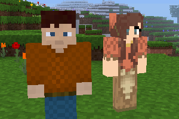

### Mobs Humans
 
**_Adds humans._**

**Version:** 0.2.0 
**Source code's license:** GPL v3.0 
**Textures' license:** CC BY-SA v3.0 / v4.0

**Dependencies:** default (found in Minetest Game), mobs (Mobs Redo) 

### Installation

Unzip the archive, rename the folder to mobs_humans and place it in 
../minetest/mods/

If you only want this to be used in a single world, place it in 
../minetest/worlds/WORLD_NAME/worldmods/

GNU+Linux - If you use a system-wide installation place it in 
~/.minetest/mods/

For further information or help see: 
https://wiki.minetest.net/Help:Installing_Mods
